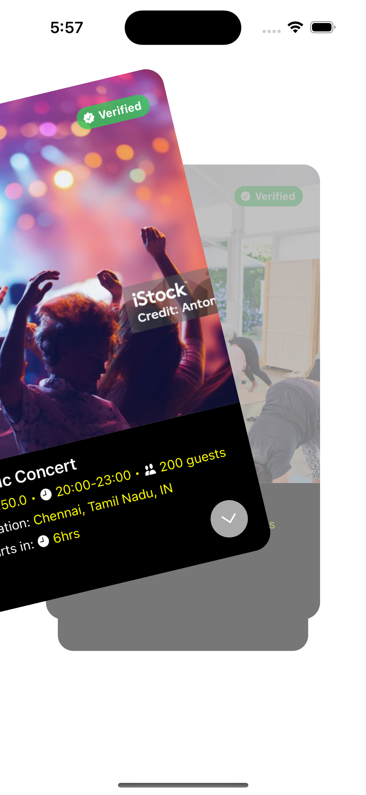
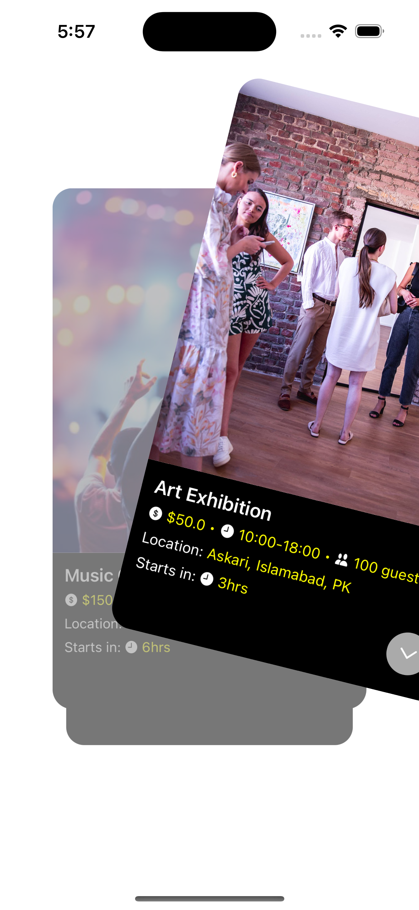

# SwipeableCardView

# CardSwipe - Swipeable Event Cards

CardSwipe is a beautifully designed iOS app feature that presents events as swipeable cards, similar to Tinder-style UI. The app allows users to interact with event cards by swiping, dynamically updating the UI with a smooth animation effect.

## Features
- 🃏 **Swipeable Card Interface** - Users can swipe through event cards effortlessly.
- 🎨 **Smooth Animations** - Seamless transitions between cards for an enhanced UX.
- 🔄 **Dynamic Card Refill** - Automatically loads new events when cards are swiped away.
- 📏 **Stacked Layout** - Supports multiple visible cards with decreasing scale effects.

## Screenshots

  

## Installation
1. Clone the repository:
   ```bash
   git clone https://github.com/programmerwali/CardSwipe.git
   ```
2. Open `CardSwipe.xcodeproj` in Xcode.
3. Build and run the project on a simulator or a physical device.

## Usage
- Swipe **left or right** to interact with event cards.
- As a card is swiped away, a new card dynamically enters the stack.
- The top card remains active while the underlying ones are disabled until brought forward.

## Code Structure
- **ViewController.swift** - Handles UI and swipe interactions.
- **SwipeableCardView.swift** - Custom `UIView` for individual event cards.
- **EventInfo.swift** - Data model for event details.

## Contributing
Contributions are welcome! Feel free to fork the repository and submit a pull request.

## License
This project is licensed under the [MIT License](LICENSE).

## Author
Developed by **Wali** 🚀


